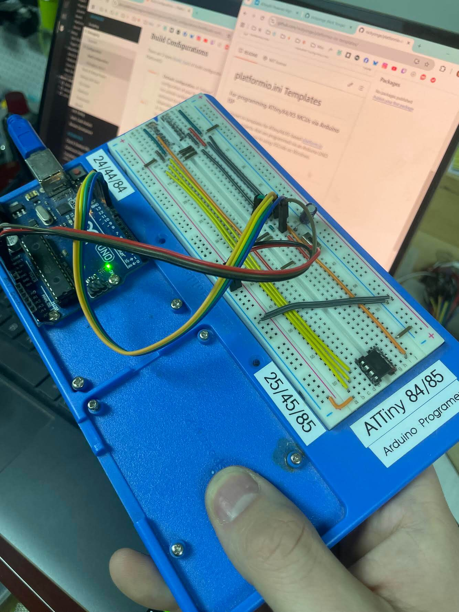

# platformio.ini Templates
### For programming ATtinyX4/X5 MCUs via Arduino ISP

Quickstart ini templates for ATtinyX4/X5-based [platform.io](https://platformio.org/) electronics projects, that are programmed via an Arduino UNO.
This guide assumes you're using VSCode on Windows.

## Troubleshooting

Some things to check if your uploads don't work:
- Ensure the Arduino is properly set up (see: [Instructables guide](https://www.instructables.com/How-to-Program-an-Attiny85-From-an-Arduino-Uno/), [Github gist](https://gist.github.com/ij96/804e731bd31dbb95b2b043e93c79ceab), [PlatformIO guide](https://docs.platformio.org/en/latest/platforms/atmelavr.html))
- Check the PlatformIO selected environment and COM port
  - Note that "Auto" COM port detection can be buggy - it's best to specifically define it in the platformio.ini, eg COM6
- Set the fuses on your chip
  - If you're 100% sure your chip is good, and the device isn't recognized, it's possible the reset pin has been disabled. In that case, [it'll need to be reset](https://www.hackster.io/sbinder/attiny85-powered-high-voltage-avr-programmer-3324e1).
  - If you're using a custom fuse build environment, ensure the `lib_deps` and `board_fuses` in platformio.ini match your board environment
- If you suspect your project is exceeding your chip's memory size, in `platformio.ini`, set [build config type](https://docs.platformio.org/en/stable/projectconf/build_configurations.html#build-configurations) to `build_type = debug` to enable size debugging, and [debug flag](https://docs.platformio.org/en/stable/projectconf/sections/env/options/debug/debug_build_flags.html) `debug_build_flags = -Os` to minimize debug build filesize (which otherwise would be significantly larger than the `release` build type)
- If you haven't, add a small polarized capacitor (eg 10uF) from your Arduino programmer's RESET pin to GND
- In weird circumstances, I've seen PIO bugs go away by using PlatformIO Extension > Project Tasks > Miscellaneous > Rebuild Intellisense Index
- Turn it off and on again :)

## Resources

Some useful links :)
- Datasheets for [ATtinyX4](https://ww1.microchip.com/downloads/en/DeviceDoc/Atmel-7701_Automotive-Microcontrollers-ATtiny24-44-84_Datasheet.pdf) and [ATtinyX5](https://ww1.microchip.com/downloads/en/devicedoc/atmel-2586-avr-8-bit-microcontroller-attiny25-attiny45-attiny85_datasheet.pdf)
- [AVR Fuse Calculator](https://www.engbedded.com/fusecalc/), and [All You Need To Know About AVR Fuses](https://embedds.com/all-you-need-to-know-about-avr-fuses/)
- [ATtiny pinout diagrams](https://github.com/SpenceKonde/ATTinyCore#attiny254585) (and the whole Arduino core repo) by [@SpenceKonde](https://github.com/SpenceKonde/)
- [AVR MCU Sleep Modes and Sleep Controller](https://onlinedocs.microchip.com/oxy/GUID-A834D554-5741-41A3-B5E1-35ED7CD8250A-en-US-5/GUID-35CAFA19-CA93-4B3E-AEE3-481B8542FE94.html)

##

